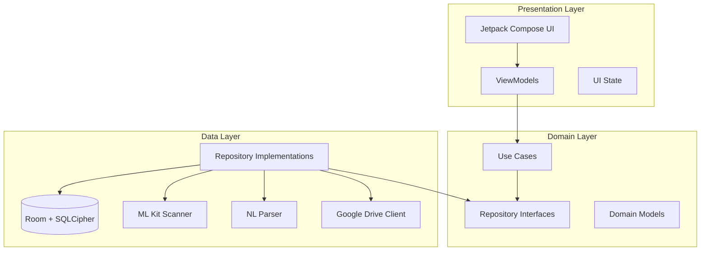

# Design Document: Document Manager

## Overview

The Document Manager is a native Android application built with Kotlin and Jetpack Compose that enables families to securely store, organize, and manage travel documents entirely on-device. The app follows Clean Architecture with MVVM presentation pattern, ensuring separation of concerns and testability.

Key architectural decisions:
- **Fully offline-first**: No cloud backend. All data lives on-device in an encrypted Room database backed by SQLCipher.
- **On-device AI**: ML Kit Text Recognition v2 and Document Scanner API provide OCR and document capture without network calls.
- **Structured NLP**: A lightweight, rule-based natural language parser handles travel queries locally using regex patterns and keyword extraction — no LLM required.
- **Multi-account isolation**: Each family member gets a separate encrypted database partition, authenticated by individual PINs.

### Research Findings

| Concern | Technology Choice | Rationale |
|---------|------------------|-----------|
| Database | Room + SQLCipher | Room provides compile-time query validation; SQLCipher adds AES-256 full-database encryption transparently |
| Key management | AndroidKeyStore | Hardware-backed key storage; keys never leave the secure element |
| Document scanning | ML Kit Document Scanner API | Google-maintained, on-device, provides edge detection and perspective correction |
| OCR | ML Kit Text Recognition v2 | On-device, supports Latin/CJK scripts, returns structured text blocks with bounding boxes |
| PIN hashing | Argon2id (via BouncyCastle) | Memory-hard KDF resistant to GPU attacks; industry standard for password hashing |
| UI | Jetpack Compose + Material 3 | Declarative, testable UI with built-in accessibility support |
| DI | Hilt | Official Android DI solution, integrates with ViewModel lifecycle |
| File import | Google Drive REST API + Picker | Picker handles OAuth and file browsing; REST API downloads the selected file |

---

## Architecture

The application follows Clean Architecture organized into three layers, with unidirectional dependency flow from outer to inner layers.



### Module Structure

```
app/
├── presentation/       # Compose screens, ViewModels, navigation
│   ├── auth/           # PIN entry, lockout UI
│   ├── documents/      # Document list, detail, import
│   ├── search/         # Search interface, results
│   └── onboarding/     # First-launch setup
├── domain/             # Pure Kotlin, no Android dependencies
│   ├── model/          # Domain entities
│   ├── repository/     # Repository interfaces
│   └── usecase/        # Business logic use cases
├── data/               # Android-dependent implementations
│   ├── local/          # Room DAOs, database, encryption
│   ├── scanner/        # ML Kit integration
│   ├── nlp/            # Natural language parser
│   └── drive/          # Google Drive import
└── di/                 # Hilt modules
```

### Key Design Decisions

1. **Database-per-member isolation**: Each family member's documents are stored in a separate encrypted database file. The encryption key is derived from their PIN + a device-specific salt stored in AndroidKeyStore. This means a PIN wipe (Requirement 2.3) only destroys that member's database file.

2. **Session management via ViewModel scope**: Authentication state lives in a singleton `AuthSessionManager` with a 30-minute inactivity timer. The timer resets on any user interaction event.

3. **Offline-only Google Drive import**: The Drive import downloads files to local storage during the brief online window. Once downloaded, the file is processed entirely offline. The app never syncs back to Drive.

4. **Rule-based NLP over ML models**: For natural language travel queries (Requirement 8), a regex + keyword parser is more predictable, testable, and doesn't require model downloads. It handles the constrained vocabulary of travel planning well.

---

## Components and Interfaces

### Authentication Module

```kotlin
interface AuthRepository {
    suspend fun createPin(memberId: String, pin: String): Result<Unit>
    suspend fun verifyPin(memberId: String, pin: String): Result<Boolean>
    suspend fun getFailedAttempts(memberId: String): Int
    suspend fun recordFailedAttempt(memberId: String): LockoutState
    suspend fun resetFailedAttempts(memberId: String)
    suspend fun wipeMemberData(memberId: String): Result<Unit>
}

data class LockoutState(
    val isLocked: Boolean,
    val remainingLockSeconds: Int,
    val shouldWipe: Boolean
)

interface SessionManager {
    val isAuthenticated: StateFlow<Boolean>
    val currentMemberId: StateFlow<String?>
    fun startSession(memberId: String)
    fun endSession()
    fun resetInactivityTimer()
}
```

### Document Storage Module

```kotlin
interface DocumentRepository {
    suspend fun getAll(memberId: String): Flow<List<Document>>
    suspend fun getById(documentId: String): Document?
    suspend fun insert(document: Document): Result<String>
    suspend fun delete(documentId: String): Result<Unit>
    suspend fun getCount(memberId: String): Int
    suspend fun search(memberId: String, query: SearchQuery): List<Document>
}

interface DocumentFileStorage {
    suspend fun store(memberId: String, fileData: ByteArray, format: DocumentFormat): Result<String>
    suspend fun retrieve(fileId: String): Result<ByteArray>
    suspend fun secureDelete(fileId: String): Result<Unit>
}
```

### Document Import Module

```kotlin
interface DocumentImporter {
    suspend fun importFromCamera(): Result<ImportedDocument>
    suspend fun importFromGoogleDrive(fileUri: Uri): Result<ImportedDocument>
    suspend fun importFromFile(uri: Uri): Result<ImportedDocument>
    fun getSupportedFormats(): List<DocumentFormat>
}

data class ImportedDocument(
    val rawBytes: ByteArray,
    val format: DocumentFormat,
    val originalFileName: String?
)
```

### Scanner / Metadata Extraction Module

```kotlin
interface MetadataExtractor {
    suspend fun extract(imageData: ByteArray): Result<ExtractionResult>
    suspend fun classifyDocumentType(imageData: ByteArray): Result<DocumentType>
}

data class ExtractionResult(
    val documentType: DocumentType,
    val metadata: Map<MetadataField, ExtractedValue>,
    val confidence: Float,
    val requiresManualReview: Boolean
)

data class ExtractedValue(
    val value: String,
    val confidence: Float
)

enum class MetadataField {
    ID_NUMBER, HOLDER_NAME, EXPIRY_DATE, ISSUE_DATE,
    BOOKING_REFERENCE, FLIGHT_DETAILS, HOTEL_NAME,
    POLICY_NUMBER, COVERAGE_PERIOD, DESTINATION, VISA_NUMBER
}
```

### Tag Management Module

```kotlin
interface TagRepository {
    suspend fun getTagsForDocument(documentId: String): List<Tag>
    suspend fun addTag(documentId: String, tagName: String): Result<Unit>
    suspend fun removeTag(documentId: String, tagName: String): Result<Unit>
    suspend fun deleteTagGlobally(memberId: String, tagName: String): Result<Unit>
    suspend fun getAllTags(memberId: String): List<Tag>
}

interface AutoTagGenerator {
    fun generateTags(documentType: DocumentType, metadata: Map<MetadataField, ExtractedValue>): List<String>
}
```

### Search Module

```kotlin
interface SearchEngine {
    suspend fun searchByTags(memberId: String, tags: List<String>): List<Document>
    suspend fun searchFreeForm(memberId: String, query: String): List<Document>
    suspend fun searchNaturalLanguage(memberId: String, query: String): SearchResult
}

sealed class SearchResult {
    data class DocumentResults(val documents: List<Document>) : SearchResult()
    data class TravelChecklist(val checklist: TravelDocumentChecklist) : SearchResult()
    data class NeedMoreInfo(val missingParams: List<String>) : SearchResult()
}
```

### Natural Language Parser Module

```kotlin
interface NaturalLanguageParser {
    fun parse(query: String): ParseResult
}

data class ParseResult(
    val intent: QueryIntent,
    val travelParams: TravelParameters?,
    val searchTerms: List<String>
)

enum class QueryIntent {
    DOCUMENT_SEARCH,
    TRAVEL_CHECKLIST,
    MISSING_DOCUMENTS
}

data class TravelParameters(
    val familySize: Int?,
    val origin: String?,
    val destination: String?,
    val durationDays: Int?,
    val rawQuery: String
)
```

### Document Generator / Checklist Module

```kotlin
interface DocumentChecklistGenerator {
    fun generateChecklist(params: TravelParameters): TravelDocumentChecklist
    fun detectMissing(
        checklist: TravelDocumentChecklist,
        existingDocuments: List<Document>
    ): List<MissingDocument>
}

data class TravelDocumentChecklist(
    val requiredDocuments: List<RequiredDocument>,
    val totalCount: Int
)

data class RequiredDocument(
    val type: DocumentType,
    val countNeeded: Int,
    val description: String
)

data class MissingDocument(
    val required: RequiredDocument,
    val suggestion: String
)
```

---

## Data Models

### Room Entity Definitions

```kotlin
@Entity(tableName = "family_members")
data class FamilyMemberEntity(
    @PrimaryKey val id: String,
    val name: String,
    val pinHash: String,        // Argon2id hash
    val pinSalt: String,        // Per-member salt
    val createdAt: Long,
    val failedAttempts: Int = 0,
    val lockedUntil: Long? = null
)

@Entity(tableName = "documents")
data class DocumentEntity(
    @PrimaryKey val id: String,
    val memberId: String,
    val type: String,           // DocumentType enum name
    val fileId: String,         // Reference to encrypted file on disk
    val format: String,         // PDF, JPG, PNG
    val originalFileName: String?,
    val createdAt: Long,
    val updatedAt: Long,
    val extractionConfidence: Float?,
    val requiresManualReview: Boolean = false
)

@Entity(tableName = "document_metadata")
data class DocumentMetadataEntity(
    @PrimaryKey(autoGenerate = true) val id: Long = 0,
    val documentId: String,
    val field: String,          // MetadataField enum name
    val value: String,
    val confidence: Float
)

@Entity(
    tableName = "document_tags",
    primaryKeys = ["documentId", "tag"]
)
data class DocumentTagEntity(
    val documentId: String,
    val tag: String,
    val isAutoGenerated: Boolean,
    val createdAt: Long
)
```

### Domain Models

```kotlin
data class Document(
    val id: String,
    val memberId: String,
    val type: DocumentType,
    val format: DocumentFormat,
    val originalFileName: String?,
    val metadata: Map<MetadataField, String>,
    val tags: List<Tag>,
    val createdAt: Instant,
    val updatedAt: Instant,
    val extractionConfidence: Float?,
    val requiresManualReview: Boolean
)

enum class DocumentType {
    PASSPORT, VISA, TICKET, HOTEL_BOOKING, HEALTH_INSURANCE, UNKNOWN
}

enum class DocumentFormat {
    PDF, JPG, PNG
}

data class Tag(
    val name: String,
    val isAutoGenerated: Boolean
)

data class SearchQuery(
    val tags: List<String> = emptyList(),
    val freeText: String? = null,
    val naturalLanguage: String? = null
)
```

### Encryption Key Derivation

```
PIN → Argon2id(pin, member_salt) → pin_hash (stored for verification)
PIN → HKDF(pin, device_key) → db_encryption_key (used as SQLCipher passphrase)
```

The `device_key` is a 256-bit key generated once and stored in AndroidKeyStore. It never leaves the hardware security module. The database encryption key is derived at runtime and held only in memory during an active session.

### File Storage Layout

```
/data/data/com.app.traveldocs/
├── databases/
│   ├── member_{id}.db          # SQLCipher-encrypted Room DB per member
│   └── app_meta.db             # Unencrypted: member list, app config
├── files/
│   └── docs/
│       └── {member_id}/
│           └── {file_id}.enc   # AES-256-GCM encrypted document files
└── shared_prefs/
    └── app_prefs.xml           # Non-sensitive app preferences
```

---

## Correctness Properties

*A property is a characteristic or behavior that should hold true across all valid executions of a system — essentially, a formal statement about what the system should do. Properties serve as the bridge between human-readable specifications and machine-verifiable correctness guarantees.*

### Property 1: Document index consistency

*For any* sequence of insert and delete operations on a member's document collection, the count returned by `getCount()` should always equal the number of successful inserts minus the number of successful deletes.

**Validates: Requirements 1.2**

### Property 2: Deleted documents are non-retrievable

*For any* document that has been successfully deleted, subsequent queries (by ID, by search, by listing) should never return that document.

**Validates: Requirements 1.5**

### Property 3: PIN lockout after threshold failures

*For any* sequence of PIN verification attempts for a member, if the number of consecutive failures reaches 3, the system should enter a locked state. If consecutive failures reach 5, the system should trigger a data wipe.

**Validates: Requirements 2.2, 2.3**

### Property 4: Session timeout on inactivity

*For any* authenticated session, if the elapsed time since the last activity exceeds 30 minutes, `isAuthenticated` should return false.

**Validates: Requirements 2.4**

### Property 5: Logout clears session

*For any* active session, after calling `endSession()`, `isAuthenticated` should be false and `currentMemberId` should be null.

**Validates: Requirements 2.5**

### Property 6: Supported format import acceptance

*For any* file with a format in {PDF, JPG, PNG} and valid content, the import operation should succeed without error.

**Validates: Requirements 3.6**

### Property 7: Import triggers extraction

*For any* successfully imported document, the system should produce an `ExtractionResult` (which may have low confidence but must exist).

**Validates: Requirements 3.7**

### Property 8: Low-confidence extraction flags manual review

*For any* `ExtractionResult` where `confidence < 0.8`, the `requiresManualReview` field should be true.

**Validates: Requirements 4.7**

### Property 9: Document type to tag mapping

*For any* document with a classified `DocumentType` in {PASSPORT, VISA, TICKET, HOTEL_BOOKING, HEALTH_INSURANCE}, the auto-generated tags should include the corresponding type tag ("passport", "visa", "ticket", "accommodation", "health" respectively).

**Validates: Requirements 5.2, 5.3, 5.4, 5.5, 5.6**

### Property 10: Destination metadata generates destination tag

*For any* extraction result containing a non-empty DESTINATION metadata field, the auto-generated tags should include a tag matching or containing the destination value.

**Validates: Requirements 5.7**

### Property 11: Date metadata generates date-range tags

*For any* extraction result containing date metadata fields (EXPIRY_DATE, ISSUE_DATE, or date-related fields), the auto-generated tags should include at least one date-range tag.

**Validates: Requirements 5.8**

### Property 12: Tag generation failure is silent

*For any* exception thrown during the tag generation process, the document import should still succeed and the document should be stored (with an empty or partial tag list).

**Validates: Requirements 5.9**

### Property 13: Adding a tag grows the tag list

*For any* document and any valid non-duplicate tag string, adding the tag should increase the document's tag count by exactly one.

**Validates: Requirements 6.2**

### Property 14: Removing a tag shrinks the tag list

*For any* document that contains tag T, removing T should decrease the tag count by one and T should not appear in the resulting tag list.

**Validates: Requirements 6.3**

### Property 15: Tag deduplication (idempotence)

*For any* document and any tag string T, adding T multiple times should result in exactly one occurrence of T in the document's tag list.

**Validates: Requirements 6.4**

### Property 16: Global tag deletion removes from all documents

*For any* tag T deleted globally for a member, no document belonging to that member should contain T in its tag list afterward.

**Validates: Requirements 6.6**

### Property 17: Search results satisfy all criteria (AND logic)

*For any* search query with tags and/or free-text criteria, every document in the result set must satisfy ALL specified criteria simultaneously: it must contain all queried tags AND match the free-text against its metadata or tags.

**Validates: Requirements 7.1, 7.2, 7.4**

### Property 18: Empty search returns empty list without error

*For any* search query that matches zero documents, the result should be an empty list and no exception should be thrown.

**Validates: Requirements 7.5**

### Property 19: NLP travel parameter extraction

*For any* natural language query containing travel pattern keywords (family size pattern, origin pattern, destination country name, duration keyword), the parser should extract the corresponding parameter with the correct value (e.g., "family of N" → familySize=N, "living in X" → origin=X, duration keywords → correct day count).

**Validates: Requirements 8.1, 8.2, 8.3, 8.4, 8.5**

### Property 20: Checklist generation for valid travel parameters

*For any* `TravelParameters` with both origin and destination specified, the `DocumentChecklistGenerator` should return a non-empty checklist.

**Validates: Requirements 8.6**

### Property 21: Family size scales per-person document requirements

*For any* `TravelParameters` with familySize = N, per-person documents in the generated checklist (e.g., passports) should have `countNeeded = N`.

**Validates: Requirements 8.7**

### Property 22: Insufficient query parameters request more info

*For any* natural language query where the parser extracts fewer than 2 meaningful travel parameters, the search result should be `NeedMoreInfo` with a list of missing parameters.

**Validates: Requirements 8.8**

### Property 23: Missing document detection is set difference

*For any* travel document checklist and set of existing documents, the missing documents should equal exactly the required documents that have no matching document in the existing set (considering type and count).

**Validates: Requirements 9.1, 9.6**

### Property 24: Missing document suggestions match type

*For any* missing document of type PASSPORT, the suggestion should contain passport validity guidance. For type VISA, it should contain visa application guidance. For type HEALTH_INSURANCE, it should contain vaccination/health guidance.

**Validates: Requirements 9.3, 9.4, 9.5**

### Property 25: Member document isolation

*For any* two distinct family members A and B, documents stored by member A should never appear in query results for member B, and vice versa.

**Validates: Requirements 10.7**

---

## Error Handling

### Error Categories and Strategies

| Category | Example | Strategy |
|----------|---------|----------|
| Authentication | Wrong PIN, lockout | Increment failure counter; lock after 3; wipe after 5. Show countdown timer during lockout. |
| Storage | Disk full, corruption | Return `Result.failure()` with descriptive error. Attempt DB recovery via `PRAGMA integrity_check`. Notify user of data loss if unrecoverable. |
| Import | Invalid format, network failure (Drive) | Return descriptive error message. Never crash. Suggest retry or alternative import method. |
| Extraction | ML Kit failure, unsupported doc type | Graceful degradation: store document without metadata, flag for manual review. |
| Tag Generation | Exception during auto-tagging | Fail silently (catch + log). Document is stored successfully without the failed tags. |
| Search | Malformed query, parser failure | Return empty results. Never show error messages for zero-match searches. For parser failures, fall back to literal text search. |
| File I/O | Encrypted file unreadable | Attempt re-derivation of decryption key. If key derivation fails, mark document as corrupted in the index. |

### Error Propagation Pattern

```kotlin
// Domain layer uses Result<T> for all fallible operations
sealed class AppError {
    data class StorageError(val message: String, val cause: Throwable?) : AppError()
    data class AuthError(val type: AuthErrorType) : AppError()
    data class ImportError(val message: String, val format: String?) : AppError()
    data class ExtractionError(val message: String) : AppError()
}

enum class AuthErrorType {
    INVALID_PIN, LOCKED_OUT, WIPED, SESSION_EXPIRED
}
```

### Resilience Patterns

1. **Transactional document import**: Import, extraction, and tag generation happen in a database transaction. If any step fails after file storage, the file is cleaned up.
2. **Secure deletion guarantee**: File deletion uses overwrite-then-delete pattern. If overwrite fails, the file is flagged for retry on next app launch.
3. **Graceful degradation**: Each processing step (import → extract → tag → index) can fail independently without blocking subsequent steps.
4. **No network dependency errors**: The app never surfaces "no internet" errors for core functionality since all core operations are offline.

---

## Testing Strategy

### Dual Testing Approach

This feature is well-suited to property-based testing for its pure domain logic (parsing, tag generation, search filtering, checklist generation), combined with example-based unit tests for specific behaviors and integration tests for Android-specific components.

### Property-Based Testing

**Library**: [Kotest Property Testing](https://kotest.io/docs/proptest/property-based-testing.html) (Kotlin-native, integrates with JUnit 5)

**Configuration**:
- Minimum 100 iterations per property test
- Custom generators for domain types (DocumentType, TravelParameters, SearchQuery)
- Each test tagged with design property reference

**Tag format**: `Feature: travel-document-manager, Property {number}: {property_text}`

**Property test coverage areas**:
- PIN authentication logic (Properties 3, 4, 5)
- Tag generation from metadata (Properties 9, 10, 11, 12)
- Tag CRUD operations (Properties 13, 14, 15, 16)
- Search filtering and AND logic (Properties 17, 18)
- NLP parameter extraction (Property 19)
- Checklist generation (Properties 20, 21, 22)
- Missing document detection (Properties 23, 24)
- Member isolation (Property 25)
- Document lifecycle (Properties 1, 2)

### Unit Testing (Example-Based)

**Library**: JUnit 5 + MockK

**Focus areas**:
- Specific PIN lockout timing (exact 5-minute window)
- Specific NLP query examples ("What documents do I need for a family of 4 living in US going to Singapore for a week?")
- Edge cases: empty queries, max tag limits (20), 100-document capacity
- Error message content for import failures
- Argon2id hash format validation
- Unsupported document type handling

### Integration Testing

**Library**: AndroidX Test + Robolectric (for non-UI), Compose Testing (for UI)

**Focus areas**:
- Room database operations with SQLCipher encryption
- ML Kit Scanner integration with sample document images
- Google Drive Picker flow (mocked OAuth)
- Camera capture pipeline
- End-to-end: import → extract → tag → search
- Offline operation verification

### UI Testing

**Library**: Compose UI Test

**Focus areas**:
- Onboarding flow for new users
- PIN entry screen and lockout display
- Document list and detail views
- Search interface interactions
- Tag management interface
- Progress indicators during import

### Test Organization

```
app/src/test/              # Unit + property tests (JVM)
├── domain/
│   ├── properties/        # Property-based tests per design property
│   ├── usecase/           # Use case unit tests
│   └── model/             # Domain model tests
├── data/
│   ├── nlp/               # NLP parser tests
│   └── tags/              # Tag generation tests
└── generators/            # Custom Kotest generators

app/src/androidTest/       # Integration + UI tests (device/emulator)
├── data/
│   ├── local/             # Room + SQLCipher tests
│   └── scanner/           # ML Kit integration tests
└── presentation/          # Compose UI tests
```

## Additional Components (Post-Initial Design)

### Document Deduplication

**Component**: `ImportViewModel` (presentation layer)
- Computes SHA-256 hash of imported file content
- Queries existing documents for matching filename + hash
- Shows confirmation dialog when duplicate detected
- Supports "Replace" (delete old + import new) and "Cancel" actions

**Interface**: Integrated into `DocumentImportUseCase` flow via ViewModel pre-check

### Document List and Viewer

**Component**: `DocumentListScreen` (presentation/documents/)
- Collects `DocumentRepository.getAll()` Flow reactively
- Renders list with type icon, filename, date, tags
- Tap navigates to viewer

**Component**: `DocumentViewerScreen` (presentation/documents/)
- Retrieves raw bytes from `DocumentFileStorage`
- **Lazy PDF rendering**: Pages rendered on-demand via `LazyColumn` + `PdfRenderer`. Only visible pages are in memory. Prevents ANR for large multi-page PDFs.
- **Async image decoding**: Large images (>4096px) decoded off-thread with `produceState` + `Dispatchers.Default`. Images >4096px on any dimension are subsampled via `inSampleSize` to prevent OOM.
- **Video**: Shows file info + "Play Video" button (delegates to external player)
- **Share button** (📤 in top bar): Uses `Intent.ACTION_SEND` with FileProvider URI. Shows Android system share sheet. Compatible with email, WhatsApp, Telegram, etc.
- **Properties collapsed by default**: "Show Properties" button at bottom. Tapping expands tags + metadata section. Maximizes content preview area.
- **GPS import location**: Shows IMPORT_LATITUDE/IMPORT_LONGITUDE in Properties when available.

### Background GPS Tracking

**Component**: `LocationTrackingService` (debug/)
- Android foreground service with `foregroundServiceType="location"`
- Persistent notification with stop action
- Configurable interval stored in SharedPreferences
- Skips logging if movement < 10m (battery optimization)
- Logs to `DebugLogger` for unified viewing

**Component**: `TrackingSettingsPanel` (debug/)
- Compose UI with toggle switch and interval chip selector
- Starts/stops the foreground service
- Persists preference

### System Telemetry Dashboard

**Component**: `DashboardContent` (presentation/MainActivity.kt)
- Compose UI with status cards: Battery, GPS, Connectivity, Document count
- `LaunchedEffect` polls system services every 5s
- Uses `BatteryManager`, `LocationManager`, `ConnectivityManager`

### Debug Logging Infrastructure

**Component**: `DebugLogger` (debug/)
- Singleton with 3 outputs: Logcat (tag: TravelDocs), ring buffer (500), file
- File at: `/data/data/com.app.traveldocs/files/debug_logs/traveldocs_debug.log`
- Auto-rotates at 5MB

**Component**: `DebugLogScreen` + `DebugFloatingButton` (debug/)
- Full-screen dark log viewer with color-coded severity
- Auto-scroll, clear, close actions
- Floating bug icon overlay on all screens

**Component**: `SystemTelemetry` (debug/)
- Captures snapshots on lifecycle events (onCreate, onResume)
- Logs: memory, battery, top processes, connectivity, GPS
- Background GPS polling with de-dupe (10m threshold)

**Component**: `LoggingInterceptors` (debug/)
- `loggedOperation()` / `loggedSync()` extension wrappers
- `.logged()` extension on `Result<T>`

### Database Recovery

**Component**: `DatabaseRecovery` (data/local/)
- Checks SQLite header magic bytes on startup
- If corrupted (empty file or invalid header), deletes DB files for Room to recreate
- Handles WAL and SHM journal cleanup
- All operations are local/offline — no network dependency
- Logs recovery actions to DebugLogger

### Document Properties UI

**Component**: `DocumentViewerScreen` enhancements
- Shows encrypted file location on disk
- Tag management (add/remove) via TagRepository
- Document rename capability
- "Open with External App" for all file types via FileProvider + Intent.ACTION_VIEW

### Video Support

- Added `VIDEO` to `DocumentFormat` enum
- Import detects video MIME types
- Viewer offers "Play Video" button that opens in external video player

### Tag Management System

**Component**: `TagManagementScreen` (presentation/tags/)
- Lists all tags with document usage count per tag
- Sortable: alphabetical or by count
- CRUD actions: create, rename, delete (with safety guard)
- Delete shows confirmation dialog with affected document count

**Component**: `TagManagementViewModel` (presentation/tags/)
- Loads all tags via TagRepository.getAllTags()
- Counts per tag via DAO query (COUNT of document_tags WHERE tag = X)
- Rename: updates tag name in all document_tags rows
- Delete guard: queries count before allowing delete; if count > 0, shows warning

**DAO Enhancement**: `DocumentTagDao`
- `getDocumentCountForTag(memberId, tag)`: Returns count of documents using a given tag
- `renameTag(memberId, oldName, newName)`: Updates tag name in all rows for a member

**Repository Enhancement**: `TagRepository`
- `renameTag(memberId, oldName, newName): Result<Unit>`
- `getTagUsageCount(memberId, tagName): Int`
- `createTag(memberId, tagName): Result<Unit>` (creates an unassigned tag entry for later use)

### Security Hardening Plan

**Vulnerability Assessment (findings from code audit):**

| # | Severity | Finding | Location | Risk |
|---|----------|---------|----------|------|
| S1 | CRITICAL | Database is UNENCRYPTED (Room without SQLCipher) | di/AppModule.kt | All document metadata stored in plaintext on disk |
| S2 | CRITICAL | No PIN gate — app uses hardcoded "default-member" bypassing auth | ImportVM, ListVM, SearchVM | Anyone with physical access sees all documents |
| S3 | HIGH | DeviceKeyManager uses fixed zero IV in fallback derivation | crypto/DeviceKeyManager.kt | Deterministic output weakens key material |
| S4 | HIGH | Temp decrypted files in cache never cleaned up | DocumentViewerScreen.kt | Plaintext copies persist on disk after viewing |
| S5 | MEDIUM | Debug logs record exact GPS coordinates to file | SystemTelemetry.kt | Location history exposed if device compromised |
| S6 | MEDIUM | No input sanitization on tag names/filenames | TagRepository, ImportVM | Path traversal, SQL-like injection possible |
| S7 | MEDIUM | Debug log file persists in release builds | DebugLogger.kt | Sensitive operation traces available on production |
| S8 | LOW | No network security config (cleartext allowed by default) | AndroidManifest.xml | MITM possible for Drive import |
| S9 | LOW | PIN bytes stay in memory indefinitely (no zeroing) | AuthRepositoryImpl | Cold boot attack vector |
| S10 | LOW | ProGuard rules keep all data layer classes unobfuscated | proguard-rules.pro | Easier reverse engineering |

**Remediation Architecture:**

1. **S1+S2 fix**: Reintroduce SQLCipher-encrypted per-member DB + PIN gate on MainActivity
2. **S3 fix**: Use SecureRandom nonce stored alongside derived key
3. **S4 fix**: Register lifecycle callback to wipe cache/shared_docs on onPause
4. **S5 fix**: Add GPS redaction setting (SharedPreferences toggle)
5. **S6 fix**: Sanitize via regex whitelist (alphanumeric + spaces + hyphens only)
6. **S7 fix**: Wrap DebugLogger.init() with `if (BuildConfig.DEBUG)` check
7. **S8 fix**: Add network_security_config.xml blocking cleartext
8. **S9 fix**: Zero PIN arrays after hash computation
9. **S10 fix**: Reduce ProGuard keep rules to minimum needed

### Encryption Consent System

**Component**: `ConsentScreen` (presentation/onboarding/)
- First-launch gate: checks SharedPreferences for consent flag
- Country selector dropdown
- Encryption explanation text
- Checkbox for agreement
- Separate PIN irrecoverability acknowledgment checkbox
- "Continue" button (disabled until both checkboxes checked)

**Component**: `ConsentPreferences` (data/local/)
- Stores: hasConsented (bool), selectedRegion (string), encryptionEnabled (bool)
- Read on every app launch to determine storage mode
- Cannot change encryption mode once documents exist

**Country Classification**:
- Encryption PERMITTED (default): US, UK, EU countries, Canada, Australia, Japan, Singapore, India, Brazil, etc.
- Encryption RESTRICTED: Countries with key escrow laws or encryption bans — user gets unencrypted mode only

**Storage Mode Routing**:
- If `encryptionEnabled = true`: Use SQLCipher DB + AES-256-GCM file encryption + PIN required
- If `encryptionEnabled = false`: Use plain Room DB + unencrypted file storage + no PIN required

### Failed PIN Notification System

**Component**: `SecurityAlertService` (data/local/auth/)
- Triggered by AuthRepositoryImpl when lockout occurs (3 failures)
- Sends SMS via Android SmsManager to configured phone number
- Prepares email payload for backend service (future integration)
- Includes timestamp and GPS coordinates in alert message

**Component**: `SecurityPreferences` (data/local/)
- Stores recovery phone number and email (encrypted SharedPreferences)
- Captured during onboarding first launch
- Editable from Settings screen

**Component**: `SettingsScreen` (presentation/settings/)
- View/edit recovery phone number
- View/edit recovery email
- Toggle SMS alerts on/off
- Shows last alert timestamp

**Backend Email Integration (future)**:
- Interface: `EmailAlertService` with method `sendAlert(email, subject, body)`
- Current stub implementation logs the alert locally
- Future: HTTP POST to backend API endpoint that sends email via SendGrid/SES
- API contract: `POST /api/alerts/email { "to": "...", "subject": "...", "body": "...", "deviceId": "..." }`

### Batch Import System

**Component**: `BatchImportViewModel` (presentation/documents/)
- Shared ViewModel for both Drive and local folder import
- **Subfolder scanning**: User chooses recursive vs root-only import. If recursive, the first-level subfolder name is promoted as an auto-tag for all documents within it.
- **Folder-to-tag mapping**: Each subfolder level in the path becomes a separate tag. e.g. root=`Personal/`, file at `Personal/Travel/2025/passport.pdf` → auto-tagged "Travel" AND "2025". Files at root get no folder tags.
- State: `BatchImportState(totalFiles, processedCount, currentFileName, errors, isComplete, isCancelled)`
- Processes files sequentially via `DocumentImportUseCase`
- Skips failures (logs error, increments skip count, continues)
- Cancellable via CoroutineJob

**Component**: `BatchImportProgressScreen` (presentation/documents/)
- Determinate LinearProgressIndicator (processed/total)
- Text: "Importing 3 of 12: passport_scan.jpg"
- Cancel button (red, bottom)
- On complete: summary card "Imported: 10 | Skipped: 2"
- "Done" button to return

**Component**: `DrivePickerScreen` (presentation/documents/)
- Google Sign-In button (if not authenticated)
- Folder list with icons (📁 folders, 📄 files)
- Breadcrumb trail: "My Drive > Travel > 2024"
- Tap folder → navigate in; Tap "Import This Folder" button
- Uses Google Drive REST API (files.list with query for folder contents)

**Component**: `LocalFolderImport` (presentation/documents/)
- Launches ACTION_OPEN_DOCUMENT_TREE via ActivityResultContract
- Recursively enumerates DocumentFile children
- Filters by MIME type (pdf, jpg, png, video/*)
- Feeds file list to BatchImportViewModel

**Import Screen redesign**:
- Three card options: "Single File" | "Google Drive Folder" | "Local Folder"
- Each card has icon, title, subtitle
- Selecting one routes to the appropriate flow

### Camera Document Capture

**Component**: `CameraImportFlow` (presentation/documents/)
- Launches ML Kit Document Scanner via ActivityResultContract
- Scanner provides: edge detection, perspective correction, auto-crop, enhancement
- Returns scanned page as URI → read into ByteArray

**Component**: `CameraPreviewScreen` (presentation/documents/)
- Shows captured image (full width)
- "Retake" button → relaunches scanner
- "Accept" button → triggers smart naming + import
- Editable filename field with OCR-suggested name
- Runs `MlKitMetadataExtractor.classifyDocumentType()` for quick type detection

**Component**: `SmartFileNamer` (data/scanner/)
- Input: raw OCR text from the captured image
- Logic:
  1. Detect type keyword → prefix (passport_, visa_, ticket_, hotel_, insurance_)
  2. Look for name pattern → append (john_smith)
  3. Look for destination → append (singapore)
  4. Look for booking ref → append (abc123)
  5. Fallback: document_{yyyyMMdd_HHmmss}
- Output: suggested filename string (sanitized, lowercase, underscores)

**Flow**:
```
ImportScreen → "Take Photo" → ML Kit Scanner → CameraPreviewScreen
  → [Retake] → ML Kit Scanner again
  → [Accept] → SmartFileNamer generates name → User edits → Import pipeline
```

- Delivery: SmsManager.sendTextMessage (requires SEND_SMS permission)
- Fallback if no SMS permission: show code in DebugLogger (dev testing)

### Cloud Backup System

**Component**: `BackupPreferences` (data/backup/)
- SharedPreferences for backup config
- Fields: destination (drive/s3/none), s3Endpoint, s3Bucket, s3AccessKey, s3SecretKey, lastBackupTime, schedule, autoBackupEnabled

**Component**: `BackupService` (data/backup/)
- `createBackupArchive(context): File` — collects encrypted files + DB + manifest into ZIP
- Manifest JSON: `{ "timestamp": "...", "docCount": N, "appVersion": "1.0", "memberId": "..." }`
- All files in the ZIP are ALREADY encrypted (AES-256-GCM) — no plaintext leaves the device

**Component**: `GoogleDriveBackup` (data/backup/)
- Uses Google Drive REST API with `drive.file` scope (only accesses files created by this app)
- Uploads ZIP to app-specific folder on Drive
- Resumable upload with progress callback
- Lists backups for restore

**Component**: `S3Backup` (data/backup/)
- HTTP-based S3-compatible upload (no AWS SDK dependency — pure OkHttp/HttpURLConnection)
- AWS Signature V4 authentication
- Multipart upload for files > 5MB
- Supports: AWS S3, MinIO, Backblaze B2, DigitalOcean Spaces, any S3-compatible endpoint
- Progress via tracking bytes written

**Component**: `BackupScreen` (presentation/settings/)
- Destination picker: Off / Google Drive / S3
- S3 config form (endpoint, bucket, access key, secret key — masked)
- "Test Connection" button for S3
- Schedule: Manual / Daily / Weekly
- "Backup Now" button
- Last backup info

**Component**: `BackupProgressScreen` (presentation/settings/)
- Reuses same pattern as BatchImportProgressScreen
- Shows: "Backing up 5/12 files... passport_scan.enc"
- Cancel button
- Summary: "Backup complete: 12 files, 45MB, uploaded to Google Drive"

**Component**: `RestoreScreen` (presentation/settings/)
- Lists available backups (from Drive or S3) with timestamps
- Tap to restore → confirmation dialog → download + extract → restart

**Permissions**:
- INTERNET: already declared
- Google Sign-In: `com.google.android.gms:play-services-auth` (already in deps)
- Drive scope: `DriveScopes.DRIVE_FILE` (app folder only, no full drive access)
- No new Android permissions needed for S3 (just INTERNET)

**Security guarantees**:
- Backup files are encrypted BEFORE upload (AES-256-GCM per file + SQLCipher DB)
- S3 secret key stored in EncryptedSharedPreferences
- No plaintext document content ever touches the network
- Restore requires the same PIN to decrypt (useless without PIN even if intercepted)

### Launch Disclaimer and Telemetry Consent

**Component**: `DisclaimerPreferences` (data/local/)
- SharedPreferences: disclaimerAccepted (bool), acceptedTimestamp (Long), telemetryConsented (bool)
- Checked on every app launch to determine start screen

**Component**: `DisclaimerScreen` (presentation/onboarding/)
- Full-screen scrollable text with sections:
  1. "No Warranty" — app is as-is, no support guaranteed
  2. "Your Data, Your Responsibility" — sharing/backup moves data off device
  3. "Privacy" — no intent to collect content
  4. "Telemetry" — anonymous usage data for improvement, opt-in
- Telemetry consent checkbox (unchecked by default = opt-in required)
- "I Understand & Continue" button

**Component**: `UsageTelemetry` modification
- All methods check `DisclaimerPreferences.telemetryConsented` before logging
- If not consented, methods return immediately (no-op)
- Toggle in Settings allows changing consent post-launch

**Launch Flow**:
```
App Launch → DisclaimerPreferences.disclaimerAccepted?
  NO  → DisclaimerScreen → (user accepts) → ConsentScreen → Main
  YES → ConsentPreferences.hasConsented?
    NO  → ConsentScreen → Main
    YES → Main (or PIN if encrypted)
```

### Airplane Mode Detection
- Read `Settings.Global.AIRPLANE_MODE_ON` via ContentResolver
- Display as status row in DiagnosticsScreen with airplane icon

- Protocol: discover → pair (6-digit code confirm) → send encrypted files → acknowledge
- Transfer encrypted .enc files directly (no decryption during transit)

**Component**: `BluetoothShareScreen` (presentation/share/)
- "Send" mode: select docs → scan for nearby → pair → send → progress
- "Receive" mode: advertise → accept pairing → receive → import pipeline

### Adaptive GPS Algorithm
**Component**: `AdaptiveLocationTracker` (replaces simple polling in LocationTrackingService)
- States: STATIONARY, MOVING
- STATIONARY → MOVING: when displacement > 20m between two consecutive fixes
- MOVING → STATIONARY: when displacement < 5m for 2+ minutes
- MOVING interval: 30s
- STATIONARY interval: 5min
- Log state transitions for timeline construction

**Component**: `GpsHistoryDao` + `GpsHistoryEntity`
- Room table: id, latitude, longitude, accuracy, timestamp, isMoving
- Query: getTimeline(startTime, endTime) → List ordered by timestamp

**Component**: `TimelineScreen` (presentation/diagnostics/)
- LazyColumn of location entries with timestamp, coordinates, moving/stationary badge
- Filterable by date range

### GPS on Document Import
- In `DocumentImportUseCase`: before building Document, call `LocationManager.getLastKnownLocation()`
- Store as additional metadata fields: `IMPORT_LATITUDE`, `IMPORT_LONGITUDE`
- Display in viewer Properties section (within expandable "Show Properties" panel)
- If GPS permission not granted or location unavailable, fields show "Location unavailable"

### Document Sharing (Android Share Sheet)
**Component**: `shareDocument()` function in DocumentViewerScreen
- Decrypts file to temporary cache location (`shared_docs/` directory)
- Creates `FileProvider` URI with correct MIME type
- Launches `Intent.ACTION_SEND` with `EXTRA_STREAM` (file URI) and `EXTRA_SUBJECT` (filename)
- `Intent.createChooser()` shows Android system share sheet
- Temporary files cleaned up on Activity pause via `TempFileCleanup`
- Supports all document types: PDF, JPG, PNG, VIDEO
- Logged in debug telemetry

### Pull-to-Refresh (Home & Document List)
**Component**: `HomeScreen` and `DocumentListScreen` in MainActivity
- `LinearProgressIndicator` shown at top when refreshing
- Triggered via invisible `TextButton` at top of content area
- Uses `rememberCoroutineScope().launch { delay(1000); isRefreshing = false }` pattern
- ViewModel's documents Flow auto-refreshes on recomposition

### Lazy Document Preview (Performance)
**Strategy**: All document types use non-blocking rendering:
- **PDF (LazyColumn)**: `PdfRenderer` opens pages on-demand. Each page rendered at 2x native resolution with white background. LazyColumn recycles off-screen pages.
- **Images (produceState)**: `BitmapFactory.Options.inJustDecodeBounds` measures dimensions. If >4096px, calculates `inSampleSize` power-of-2 downsample. Actual decode happens on `Dispatchers.Default` (background thread). UI shows `CircularProgressIndicator` until ready.
- **Video**: No rendering needed (icon + external player button)

### Advanced Backup Structure
```
TravelDocs_Backup/
├── backup_20240815_093022/
│   ├── manifest.json
│   ├── database/
│   │   └── traveldocs.db
│   └── docs/
│       └── default-member/
│           ├── abc123.enc
│           └── def456.enc
├── backup_20240820_141500/
│   ├── manifest.json
│   └── ...
```

**Manifest schema v2**:
```json
{
  "timestamp": "2024-08-15T09:30:22",
  "appVersion": "1.0",
  "memberId": "default-member",
  "docCount": 5,
  "totalSizeBytes": 2456000,
  "files": [
    {"name": "abc123.enc", "type": "PASSPORT", "originalName": "passport.jpg", "size": 253000},
    {"name": "def456.enc", "type": "TICKET", "originalName": "flight.pdf", "size": 180000}
  ]
}
```

**Restore modes**:
- **Replace all**: Delete current DB + files → extract backup
- **Merge (skip duplicates)**: Compare `originalName` from manifest → skip if exists in current DB → import only new

### Feature Flags System

**Component**: `FeatureFlags` (data/local/)
- SharedPreferences-backed boolean flags
- Master toggle: "Experimental Features"
- Sub-flags: google_drive, s3_storage, backup_restore, gps_tracking
- Checked by UI components before showing experimental features
- Settable from Settings screen

**Gating behavior**:
- Backup menu item: hidden unless `backup_restore = true`
- Google Drive backup card: hidden unless `google_drive = true`
- S3 backup card: hidden unless `s3_storage = true`
- All sub-toggles hidden when `experimental = false`
- Default state: all OFF (stable features only visible)
