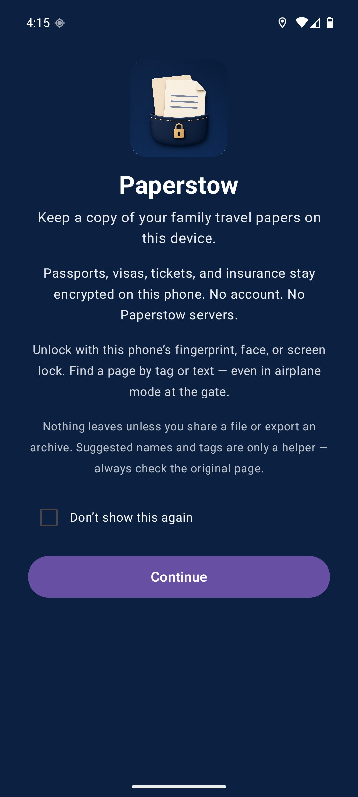
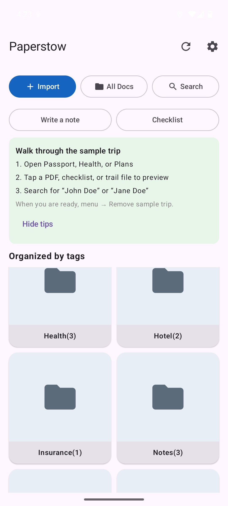
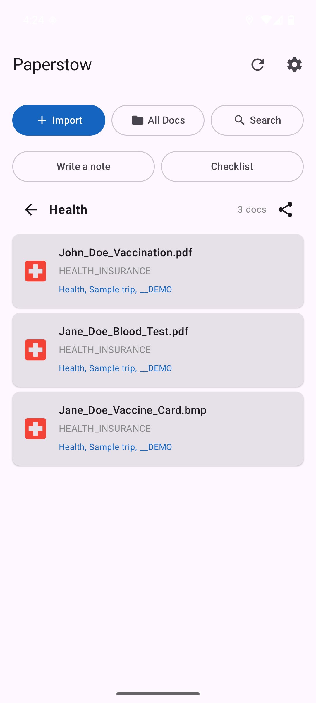
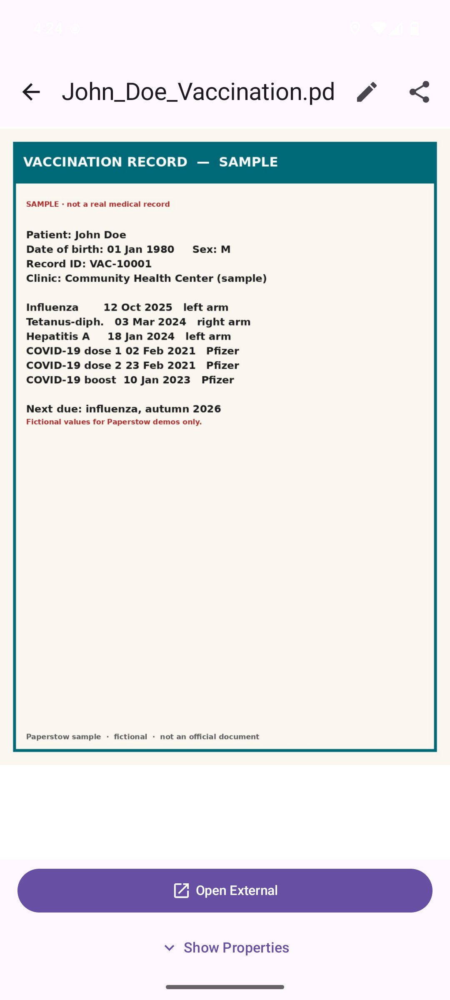
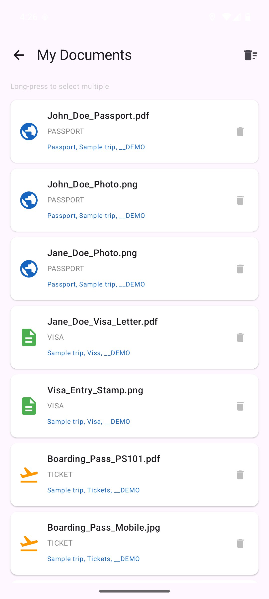
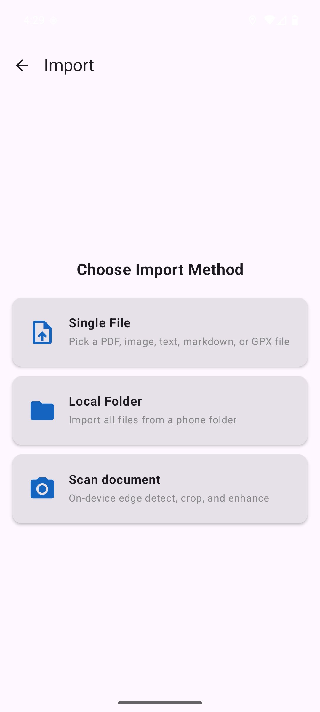
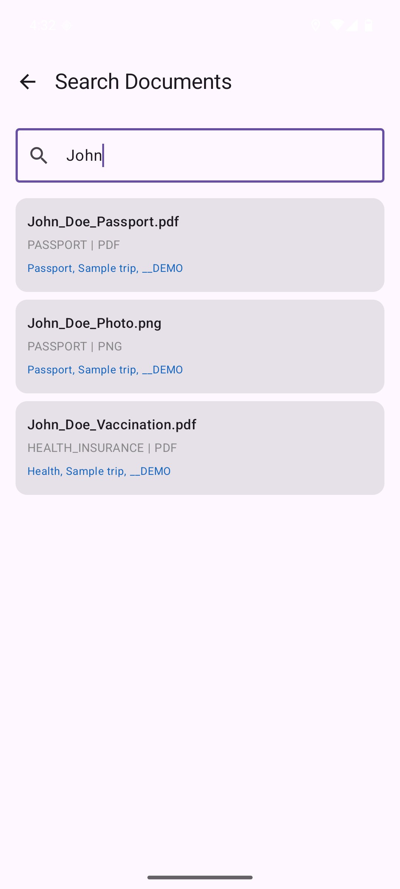
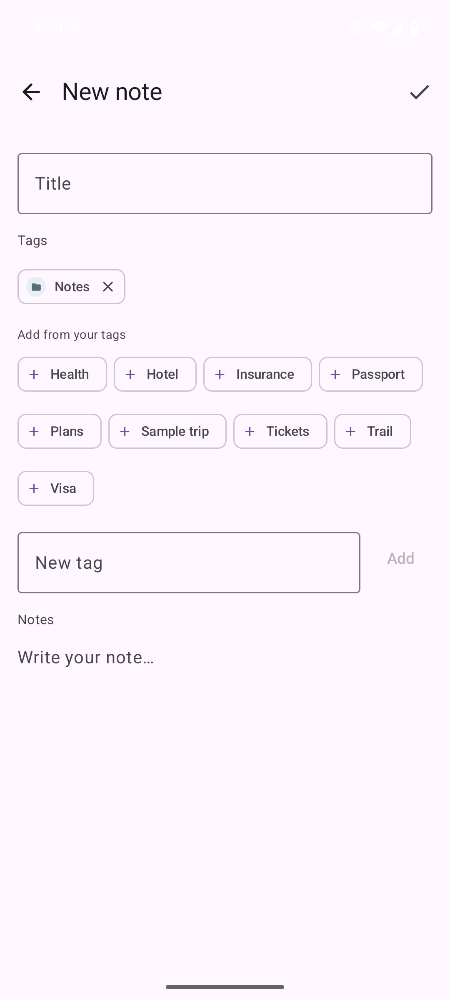
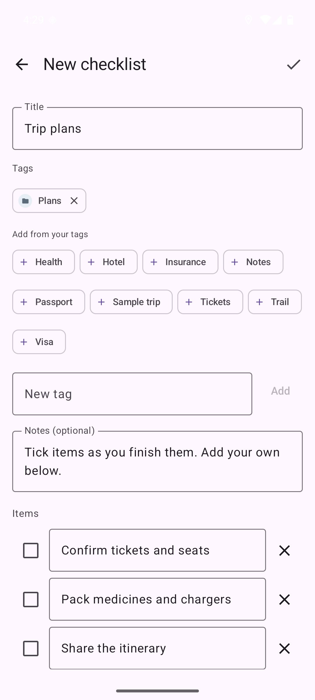
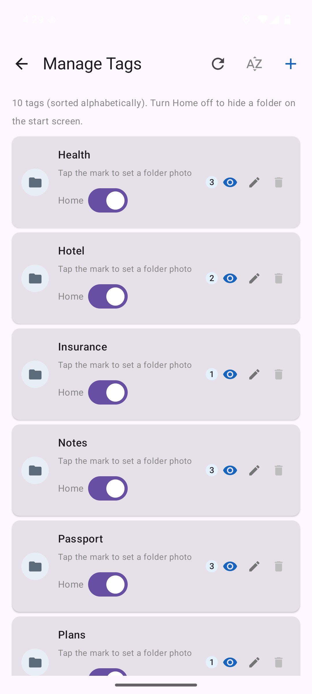

# Paperstow

Keep a copy of your family travel papers on this device. Encrypted. No account. No cloud.

## Why this exists

I needed a place to keep passport scans, visas, tickets, and insurance on the phone where:
- They're encrypted and unlocked with the device's fingerprint, face, or screen lock
- Nothing gets uploaded unless I share or archive it
- I can find a page fast with tags and on-device OCR
- Large PDFs don't hang the app

So I built Paperstow. It's open source, free, and the community is welcome to improve it.

## What it does

- **Import** from files, camera, or a local folder
- **OCR** extracts text and classifies travel papers (passport, visa, ticket, and similar)
- **Encrypt** with AES-256-GCM; keys stay in Android KeyStore
- **Search** by tags and text from the page
- **Share** through Android's share sheet when a family member needs a copy
- **Archive & restore** — password-protected ZIP to a folder you pick
- **Folder import** — subfolder names become tags
- **Dark theme** — toggle in settings


## Demo

[](https://youtube.com/shorts/E43BueHc3gQ?feature=share)

Watch the demo: https://youtube.com/shorts/E43BueHc3gQ?feature=share

## Screenshots

| | | |
|:---:|:---:|:---:|
|  |  |  |
| Splash Screen | Organized by Tags | Documents in Tag Folder |
|  |  |  |
| Document Preview | All Documents | Import Methods |
|  |  |  |
| Search Documents | Backup & Restore | Experimental Features |
|  | | |
| Review & Classify | | |

## Principles

1. Your documents never leave the phone unless YOU share or archive them
2. No telemetry without explicit opt-in consent
3. The app works fully offline — internet is only for an optional OCR model refresh

## Built with AI

This app was built and tested with AI assistance (Kiro). All document processing (OCR, classification, tagging) happens locally on your device using third-party libraries (ML Kit, etc.). Classification errors can and will occur due to the quality and limitations of those libraries — the app makes no guarantee of accuracy. Always verify extracted data independently before relying on it.

The code is real, it compiles, it runs. If you spot something that could be cleaner, more idiomatic, or just better: PRs and issues are welcome.

## Download

Pre-built APKs are available from [GitHub Releases](https://github.com/sethusrinivasan/document-manager/releases).

1. Download `app-debug.apk` from the latest release
2. Transfer to your Android phone
3. Open and install (enable "Install from unknown sources" if prompted)

No build tools required — just download and install.

### App Name
This app is called **Paperstow** — a place to stow the family's travel papers on the phone.


## Installing on Your Android Device

Pre-built APKs are available at **[github.com/sethusrinivasan/document-manager/releases](https://github.com/sethusrinivasan/document-manager/releases)**.

### Prerequisites on Your Android Device

1. **Android 8.0 or later** (API 26+)
2. **Enable "Install unknown apps":**
   - Go to **Settings → Apps → Special app access → Install unknown apps**
   - Select your browser or file manager and toggle **Allow from this source**
   - On older Android: **Settings → Security → Unknown sources** (toggle on)

### Which APK to download?

| APK | Use case |
|-----|----------|
| `document-manager-debug.apk` | Development / testing — includes debug logs and diagnostics |
| `document-manager-release.apk` | Production — optimized, no debug overhead |

For general use, download the **release** APK.

### Option A — Install directly on device (simplest)

1. On your Android phone, open the [Releases page](https://github.com/sethusrinivasan/document-manager/releases) in Chrome
2. Tap the APK file to download it
3. When prompted, tap **Open** or find it in your Downloads app
4. Tap **Install** → **Done**

### Notes
- **App Name:** Paperstow
- **Package Name:** `com.app.paperstow`
- When installing, you'll see it as "Paperstow" on your app drawer

### Option B — Install via USB from your computer

Requires [Android Platform Tools](https://developer.android.com/tools/releases/platform-tools) (includes `adb`).

```bash
# Enable Developer Options on phone:
# Settings → About phone → tap "Build number" 7 times

# Enable USB Debugging:
# Settings → Developer options → USB debugging → ON

# Connect phone via USB, then:
adb install document-manager-release.apk

# Or use the deploy script if you cloned the repo:
./scripts/deploy.sh release
```

### Option C — Install via ADB wirelessly (Android 11+)

```bash
# On phone: Settings → Developer options → Wireless debugging → ON
# Note the IP address and port shown
adb pair <ip>:<port>          # Enter pairing code from phone
adb connect <ip>:<port>
adb install document-manager-release.apk
```

### After Installing

1. Launch **Paperstow** from your app drawer
2. Read and accept the End User License Agreement
3. The app uses your device's **biometric authentication** (fingerprint/face/PIN) — no separate app password needed
4. Start importing documents via **Import** button on the home screen

## Quick start

```bash
# You need JDK 17 and Android SDK (API 36 for Play Store compliance)

# On Ubuntu/Linux, run the setup script
bash scripts/setup.sh

# On macOS, run the setup script
bash scripts/setup.sh

# Then build
./gradlew assembleDebug
adb install -r app/build/outputs/apk/debug/app-debug.apk
```

See the [full setup guide](#development-setup) below if you need to install the toolchain from scratch.

## Project layout

```
app/src/main/java/com/app/paperstow/
├── domain/            # Business logic. Pure Kotlin. No Android deps.
│   ├── model/         # Document, Tag, SearchResult, etc.
│   ├── repository/    # Interfaces only
│   └── usecase/       # Import pipeline, search orchestration
├── data/              # The dirty work. Room, ML Kit, filesystem, crypto.
│   ├── local/         # DB, encryption, auth, feature flags
│   ├── scanner/       # ML Kit OCR wrapper
│   ├── nlp/           # Regex-based travel query parser
│   ├── dicom/         # Custom DICOM parser (no deps, from first principles)
│   └── backup/        # ZIP packaging, Drive/S3 upload
├── presentation/      # Compose screens + ViewModels
│   ├── documents/     # Import, list, viewer, batch import
│   ├── search/        # Search screen
│   ├── settings/      # Feature flags, preferences
│   └── onboarding/    # Disclaimer, consent, splash
├── debug/             # Logger, crash handler, GPS service, telemetry
└── di/                # Hilt modules
```

The domain layer has zero Android imports. Data implements domain interfaces. Presentation talks to domain via ViewModels. Standard clean architecture, nothing exotic.

## Tech choices and why

| Choice | Why |
|--------|-----|
| Compose + Material 3 | Declarative, testable, good accessibility support out of the box |
| Room (no SQLCipher) | Files are encrypted individually. DB only has metadata. SQLCipher added 14MB and a 16KB alignment headache. |
| AES-256-GCM per file | Each doc encrypted separately. KeyStore-backed. Losing one file doesn't compromise others. |
| Biometric auth | Simpler than custom PIN, harder to bypass, zero crypto bugs from us |
| ML Kit on-device | Offline OCR requirement. No API keys. Google maintains it. |
| Regex NLP (not LLM) | For travel queries. Predictable, testable, no model downloads. Handles the constrained vocab fine. |
| Hilt | Standard Android DI. ViewModels get auto-scoped. |
| Kotest property tests | Domain invariants verified with random inputs, not just cherry-picked examples |

## App Name: Paperstow

This app is called **Paperstow**. The listing title is unique; the Android package remains `com.app.paperstow`.

## Feature flags

All experimental stuff is behind toggles in Settings → Experimental Features:

- **Google Drive** — Drive backup/import
- **S3 Storage** — Any S3-compatible endpoint
- **Backup & Restore** — The backup menu item itself
- **GPS Tracking** — Background location logging
- **Extended Formats** — WebP, HEIC, BMP, GIF, DICOM support

Everything is OFF by default. Users see only stable features until they opt in.

## The DICOM thing

Yeah, there's a DICOM viewer. Built from scratch — no library. Parses the tag-length-value structure, extracts pixel data at (7FE0,0010), applies window/level for grayscale, handles 8/12/16-bit and RGB. It's not a medical-grade viewer (no JPEG2000 compressed DICOMs) but it handles uncompressed studies fine for personal reference.

## Known rough edges

- PDF zoom: works but `PdfRenderer` has thread affinity constraints — pages render sequentially
- Google Drive auth: flaky on some devices (Google's SDK issue, not ours)
- HEIC: only works on API 28+ (covers ~95% of devices)
- The NLP parser is a glorified regex engine — it handles travel-related queries but don't ask it philosophy questions

## Development setup

### Prerequisites

- **JDK 17** — Azul Zulu or Temurin work well
- **Android SDK** — API 36, Build Tools 35.0.0
- **A phone or local emulator** — `scripts/setup.sh` installs AVD `Paperstow_API36` (Play Store image) if it is not already present

### Environment

For **Ubuntu/Linux**:
```bash
# Run the setup script to install all dependencies
bash scripts/setup.sh

# Or manually configure environment
export JAVA_HOME=/usr/lib/jvm/java-17-openjdk-amd64
export ANDROID_HOME=$HOME/android-dev-tools/android-sdk
echo "sdk.dir=$ANDROID_HOME" > local.properties
```

For **macOS**:
```bash
# Run the setup script to install all dependencies
bash scripts/setup.sh

# Or manually configure environment
export JAVA_HOME=/Library/Java/JavaVirtualMachines/temurin-17.jdk/Contents/Home
export ANDROID_HOME=$HOME/android-dev-tools/android-sdk
echo "sdk.dir=$ANDROID_HOME" > local.properties
```

### Build & Deploy

```bash
# Build only
./gradlew assembleDebug       # debug APK
./gradlew assembleRelease     # release APK (unsigned)

# Build both APK and AAB for Play Store
./scripts/build-release.sh

# One-command build + deploy (default: debug; starts Paperstow_API36 if needed)
./scripts/deploy.sh debug

# Or specify variant
./scripts/deploy.sh release   # production build (minified, no debug logs)
./scripts/deploy.sh debug     # development build (debug logs, diagnostics)
```

### App Signing for Play Store

Before publishing to Google Play Store, you need to generate a release keystore:

```bash
./scripts/release_keystore.sh
```

This creates `~/release.keystore` used for signing release builds.

### Build & deploy

```bash
# One-command build + deploy (default: debug; starts Paperstow_API36 if needed)
./scripts/deploy.sh debug

# Or specify variant
./scripts/deploy.sh release   # production build (minified, no debug logs)
./scripts/deploy.sh debug     # development build (debug logs, diagnostics)

# Manual build only (no deploy)
./gradlew assembleDebug       # debug APK
./gradlew assembleRelease     # release APK (unsigned)
```

### Tests

```bash
./gradlew test                             # all unit + property tests
./gradlew test --tests "*.properties.*"    # property tests only
```

### Debugging

```bash
# Pull all logs from device
./scripts/pull-logs.sh

# Live logcat
adb logcat -s TravelDocs                   # live logs
adb shell run-as com.app.paperstow cat files/debug_logs/traveldocs_debug.log
```

Or just tap the 🐛 icon in the app — there's a full log viewer built in.

## Contributing

Fork it, branch off `main`, make your changes, open a PR. Keep commits focused and messages in imperative mood.

Things that would be particularly useful:
- Compressed DICOM support (JPEG2000, RLE)
- Better NLP parser (maybe a small on-device model?)
- UI/UX polish — animations, transitions, dark theme refinement
- Accessibility audit
- Integration tests with real document fixtures

## Security notes

- Documents encrypted at rest (AES-256-GCM, key in hardware KeyStore)
- Temp files cleaned on app pause
- No cleartext HTTP (network security config enforced)
- Debug logging disabled in release builds
- PIN/key material zeroed after use
- Crash reports stored locally only — user manually sends via email if they choose

## Docs

| Doc | What's in it |
|-----|-------------|
| [docs/ARCHITECTURE.md](docs/ARCHITECTURE.md) | System overview, layer architecture, data flows, security model, DB schema |
| [docs/wireframes.md](docs/wireframes.md) | ASCII wireframes for all screens |
| [.kiro/specs/…/requirements.md](.kiro/specs/travel-document-manager/requirements.md) | 47 requirements with acceptance criteria |
| [.kiro/specs/…/design.md](.kiro/specs/travel-document-manager/design.md) | Component interfaces, algorithms |
| [PRIVACY_POLICY.md](docs/PRIVACY_POLICY.md) | Privacy policy (required for Play Store) |
| [LICENSE](LICENSE) / [NOTICE](NOTICE) | Apache 2.0 plus third-party attribution |
| [docs/THIRD_PARTY_LICENSES.md](docs/THIRD_PARTY_LICENSES.md) | Dependency license inventory |
| [docs/KIRO_GENERATION_PROMPT.md](docs/KIRO_GENERATION_PROMPT.md) | One-shot Kiro prompt to regenerate this app + 10 key design decisions |

## License

Paperstow source is **Apache License 2.0**. See [LICENSE](LICENSE) and [NOTICE](NOTICE).

Third-party components keep their own terms (Apache 2.0, Bouncy Castle MIT-style, Google ML Kit / Play services, and EPL-2.0 JUnit on the test classpath). Inventory: [docs/THIRD_PARTY_LICENSES.md](docs/THIRD_PARTY_LICENSES.md).

## Acknowledgments

- [AndroidX](https://developer.android.com/jetpack/androidx) / [Jetpack Compose](https://developer.android.com/jetpack/compose) — UI and platform (Apache 2.0)
- [ML Kit](https://developers.google.com/ml-kit) — on-device OCR and document scanner ([ML Kit Terms](https://developers.google.com/ml-kit/terms))
- [Bouncy Castle](https://www.bouncycastle.org/) — Argon2id / HKDF (Bouncy Castle Licence)
- [Zip4j](https://github.com/srikanth-lingala/zip4j) — password-protected ZIP archives (Apache 2.0)
- [Hilt](https://dagger.dev/hilt/) — dependency injection (Apache 2.0)
- [Material Icons](https://fonts.google.com/icons) — icon set (Apache 2.0)
- [Kotest](https://kotest.io/) — property-based testing (Apache 2.0)
