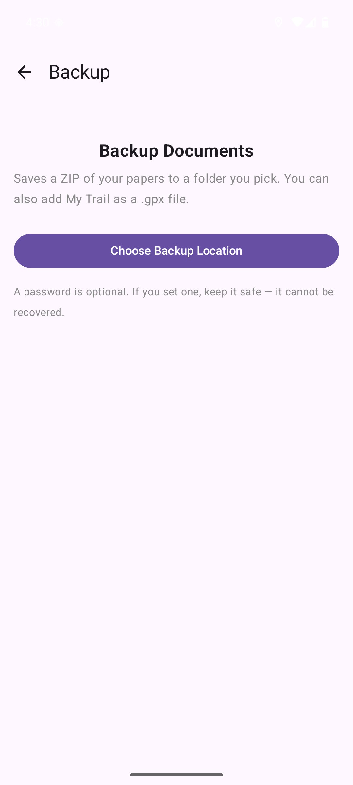
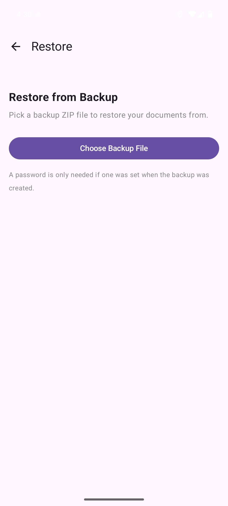
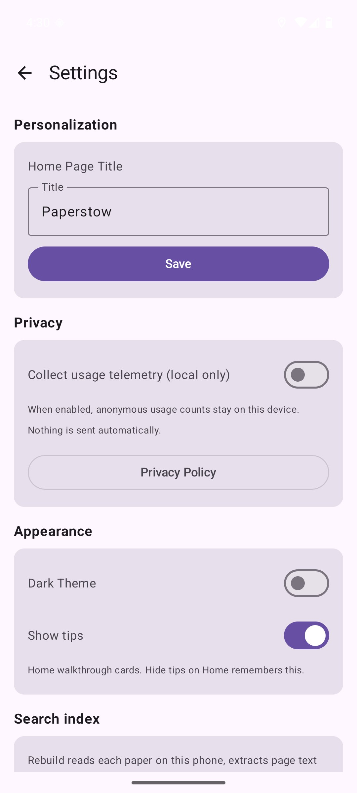
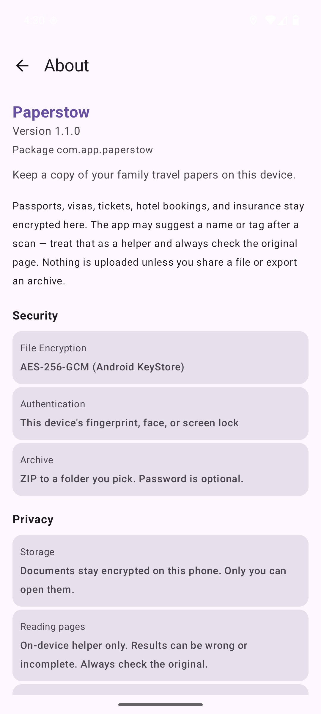
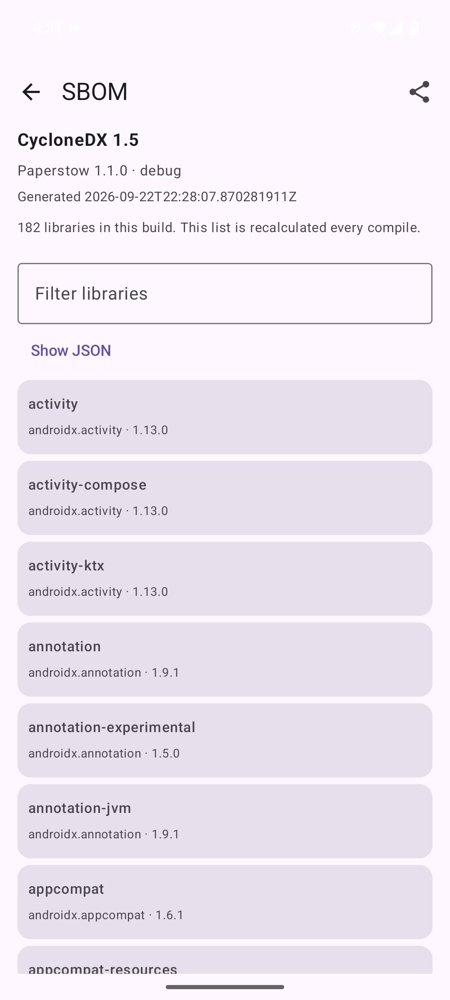
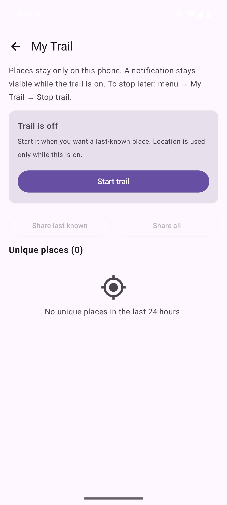

# Paperstow

[](https://github.com/sethusrinivasan/document-manager/actions/workflows/build.yml)
[](https://github.com/sethusrinivasan/document-manager/actions/workflows/codeql.yml)
[](LICENSE)
[](docs/PLAY_STORE.md)
[](app/build.gradle.kts)
[](https://kotlinlang.org)
[](https://github.com/sethusrinivasan/document-manager/releases/latest)
[](https://kiro.dev)
[](https://cursor.com)

Keep a copy of your family travel papers on this device. Encrypted. No account. No cloud.

**Package:** `com.app.paperstow` · **Version:** 1.1.0 (`versionCode` 3)

## Why this exists

Paperstow keeps a family's travel papers — passports, visas, tickets, hotel bookings, insurance — on this phone so they stay searchable at the gate. Files are encrypted on the device. Unlock uses the phone's fingerprint, face, or screen lock. The app works in airplane mode.

## What it does

- **Import** a PDF or photo, scan a page with the on-device document scanner, or pull in a folder (subfolder names become tags). Other apps can share a file into Paperstow.
- **Read the page** with bundled ML Kit Latin OCR. The app may suggest a type (passport, visa, ticket, and similar) and keep extracted text so Search can find words from the page.
- **Encrypt** each file with AES-256-GCM. Keys stay in Android KeyStore.
- **Organize** with tags, folder art on Home, notes, and checklists.
- **Search** by filename, tag, or text from the page. Settings can rebuild that index on the phone.
- **Share** a copy through Android's share sheet when someone needs it.
- **Archive and restore** a ZIP to a folder you pick when you change phones. A password is optional. Restore checks the backup database before swapping it in.
- **My Trail** (optional) keeps unique places from the last 24 hours on this phone, with battery at each save, and can add them to a backup as GPX.
- **Settings** cover dark theme, home tips, optional on-device usage counts, search rebuild, and Reset App.
- **About** shows version, package name (`com.app.paperstow`), and the CycloneDX SBOM built into that APK.

A member can hold up to 100 documents, 20 tags each. Folder import takes up to 500 files.

## How it stays on the device

Papers stay on this phone unless you share a file or export an archive. Optional telemetry is off until you turn it on; counts never leave the device by themselves. Everyday use works offline. The only network the app may use is an ML Kit / scanner model refresh from Play services.

## Built with AI

This app was built and tested with AI assistance: first [Kiro](https://kiro.dev) (spec-first generation), then [Cursor](https://cursor.com). All document processing (OCR, classification, tagging) happens on the device using third-party libraries (ML Kit and others). Classification errors can and will occur. Always verify extracted data against the original page.

The code compiles and runs. If something could be cleaner: PRs and issues are welcome.

## Demo

Emulator walkthrough of Paperstow 1.1 after loading the sample trip. Home, a tag folder, preview, import, search, checklist, backup, and About.

<video src="docs/demo/paperstow-emulator-demo.mp4" controls width="360" poster="docs/screenshots/2.jpg">
  <a href="docs/demo/paperstow-emulator-demo.mp4">Play the demo video</a>
</video>

If the player does not show: [docs/demo/paperstow-emulator-demo.mp4](docs/demo/paperstow-emulator-demo.mp4)

## Screenshots

Captured from the `Paperstow_API36` emulator after loading the sample trip. See [`docs/screenshots/MANIFEST.txt`](docs/screenshots/MANIFEST.txt).

| | | |
|:---:|:---:|:---:|
|  |  |  |
| Splash | Home (sample trip) | Health tag folder |
|  |  |  |
| Document preview | All documents | Import |
|  |  |  |
| Search | Write a note | Checklist |
|  |  |  |
| Manage tags | Backup (password optional) | Restore |
|  |  |  |
| Settings | About | SBOM |
|  | | |
| My Trail | | |

## Download

CI on `main` publishes GitHub Releases. The workflow runs `assembleDebug` and uploads:

| File | What it is |
|------|------------|
| `document-manager-debug.apk` | Debug APK from `app/build/outputs/apk/debug/app-debug.apk` |
| `sbom.json` | CycloneDX 1.5 SBOM for that build (when generated) |

A `document-manager-release.apk` appears only if a release APK was produced in that job. Default CI does **not** run `assembleRelease`. For a minified Play build, use `./scripts/build-release.sh` locally.

1. Open [Releases](https://github.com/sethusrinivasan/document-manager/releases)
2. Download the debug APK (or a release APK if present)
3. On Android 8.0+ (API 26), enable install from that browser or file manager, then install

`com.app.paperstow` is a new applicationId. It does not upgrade an older `com.app.traveldocs` install.

### Install via USB or wireless debugging

```bash
# USB (Developer options → USB debugging)
adb install document-manager-debug.apk

# Or from a clone:
./scripts/deploy.sh debug

# Android 11+ wireless debugging
adb pair <ip>:<port>
adb connect <ip>:<port>
adb install document-manager-debug.apk
```

After install: accept the EULA, unlock with the device biometric or screen lock, then Import (or overflow → Load sample trip).

## Quick start (from source)

```bash
# JDK 17 and Android SDK (compile/target API 36)
bash scripts/setup.sh
./gradlew assembleDebug
./scripts/deploy.sh debug
```

`scripts/setup.sh` installs AVD `Paperstow_API36` if it is missing.

## Project layout

```
app/src/main/java/com/app/paperstow/
├── domain/              # Models, repository interfaces, import use case. No Android UI.
│   ├── model/
│   ├── repository/
│   ├── usecase/
│   └── safety/          # My Trail uniqueness + GPX
├── data/
│   ├── local/           # Room (traveldocs.db v4), crypto, search index
│   ├── importer/        # File / folder import
│   ├── scanner/         # ML Kit OCR + document scanner
│   ├── nlp/             # Regex travel parser + checklist generator
│   ├── tags/
│   ├── backup/          # ZIP archive / restore (optional AES), Room file swap
│   ├── safety/          # My Trail foreground service
│   └── demo/            # Sample trip
├── presentation/        # Compose screens + ViewModels
│   ├── documents/       # Import, list, viewer, notes, checklists
│   ├── search/, tags/, settings/, backup/, about/
│   ├── safety/, review/, feedback/, diagnostics/, onboarding/
└── debug/               # Logger, crash handler, optional local telemetry
```

Room still uses the filename `traveldocs.db` so older backups can restore.

## Tech choices

| Choice | Why |
|--------|-----|
| Compose + Material 3 | Single-activity UI |
| Room (metadata only) | Each file is encrypted separately. The DB holds names, OCR text, tags, and My Trail points. |
| AES-256-GCM per file | KeyStore-backed. Losing one file does not expose others. |
| Transportable backup ZIP | Archive decrypts files into the ZIP so another phone can restore. Optional Zip4j AES password. |
| BiometricPrompt | Unlock with this phone's fingerprint, face, or screen lock. |
| Bundled ML Kit Latin | OCR for photos and the first four PDF pages (rendered on a white bitmap). |
| Regex NLP | Constrained travel queries (for example, what to pack for a trip). |
| Hilt | Standard Android DI |
| Kotest property tests | Domain invariants with random inputs |
| CycloneDX SBOM | Generated per variant into assets; About can show it |

## Known rough edges

- PDF pages render one at a time (`PdfRenderer` thread affinity).
- HEIC import needs API 28+.
- Travel queries use a small regex parser.
- Folder import over SAF is slow on very large trees (Binder per file); work runs on `Dispatchers.IO`.
- Installing `com.app.paperstow` sits beside an older `com.app.traveldocs` install if one is still on the phone.

Library-level notes: [docs/KNOWN_ISSUES.md](docs/KNOWN_ISSUES.md).

## Development

### Prerequisites

- JDK 17 (Temurin or Azul Zulu)
- Android SDK API 36, Build Tools 35.0.0
- Phone or emulator (`Paperstow_API36`)

```bash
bash scripts/setup.sh
# Linux example if you skip the script:
export JAVA_HOME=/usr/lib/jvm/java-17-openjdk-amd64
export ANDROID_HOME=$HOME/android-dev-tools/android-sdk
echo "sdk.dir=$ANDROID_HOME" > local.properties
```

### Build

```bash
./gradlew assembleDebug
./gradlew assembleRelease          # unsigned unless ~/release.keystore is present
./scripts/build-release.sh         # APK + AAB for Play
./scripts/deploy.sh debug          # default; starts the AVD if needed
./scripts/deploy.sh release
./gradlew testDebugUnitTest
./gradlew test --tests "*.properties.*"
./scripts/pull-logs.sh
adb logcat -s TravelDocs
adb shell run-as com.app.paperstow cat files/debug_logs/traveldocs_debug.log
```

Play signing: `./scripts/release_keystore.sh` then `DOCVAULT_*` env vars (see [docs/PLAY_STORE.md](docs/PLAY_STORE.md)).

CI (`.github/workflows/build.yml`) uses `android-actions/setup-android@v4` with `packages: platform-tools`. Do not revert to v3 — its default `tools` package is gone and `sdkmanager` exits 1.

## Contributing

Fork, branch from `main`, open a PR. Keep commits focused.

Useful work: a stronger on-device parser, UI polish, accessibility, and instrumentation tests with real fixtures.

## Security

- Files at rest: AES-256-GCM, key in hardware KeyStore when the device supports it
- Archive ZIP may contain **plaintext** document bytes (so another device can restore). Use a password if the ZIP will leave your control.
- Temp share files are cleaned on pause
- Cleartext HTTP is blocked by network security config
- Debug logging is off in release
- Crash reports stay local unless you email them

How to report a vulnerability: [SECURITY.md](SECURITY.md).

## Docs

| Doc | What's in it |
|-----|-------------|
| [docs/ARCHITECTURE.md](docs/ARCHITECTURE.md) | Layers, import pipeline, schema, backup, My Trail |
| [docs/PLAY_STORE.md](docs/PLAY_STORE.md) | Listing copy, permissions, signing |
| [docs/PRIVACY_POLICY.md](docs/PRIVACY_POLICY.md) | Privacy policy (source) |
| [docs/privacy.html](docs/privacy.html) | Same policy for GitHub Pages |
| [docs/KNOWN_ISSUES.md](docs/KNOWN_ISSUES.md) | Room WAL, PdfRenderer, Zip4j, ML Kit |
| [docs/THIRD_PARTY_LICENSES.md](docs/THIRD_PARTY_LICENSES.md) | Dependency licenses |
| [docs/wireframes.md](docs/wireframes.md) | Current screen map + historical ASCII |
| [LICENSE](LICENSE) / [NOTICE](NOTICE) | Apache 2.0 + attribution |
| [docs/demo/paperstow-emulator-demo.mp4](docs/demo/paperstow-emulator-demo.mp4) | Emulator demo (sample trip) |
| [docs/KIRO_GENERATION_PROMPT.md](docs/KIRO_GENERATION_PROMPT.md) | Historical generation prompt |
| [.kiro/specs/…](.kiro/specs/travel-document-manager/requirements.md) | Original Kiro spec |

## License

Paperstow source is **Apache License 2.0**. See [LICENSE](LICENSE) and [NOTICE](NOTICE).

Third-party components keep their own terms (Apache 2.0, Bouncy Castle MIT-style, Google ML Kit / Play services, EPL-2.0 JUnit on the test classpath). Inventory: [docs/THIRD_PARTY_LICENSES.md](docs/THIRD_PARTY_LICENSES.md).

## Acknowledgments

- [AndroidX](https://developer.android.com/jetpack/androidx) / [Jetpack Compose](https://developer.android.com/jetpack/compose)
- [ML Kit](https://developers.google.com/ml-kit) — on-device OCR and document scanner
- [Bouncy Castle](https://www.bouncycastle.org/) — Argon2id / HKDF
- [Zip4j](https://github.com/srikanth-lingala/zip4j) — optional AES ZIP
- [Hilt](https://dagger.dev/hilt/)
- [Kotest](https://kotest.io/)
